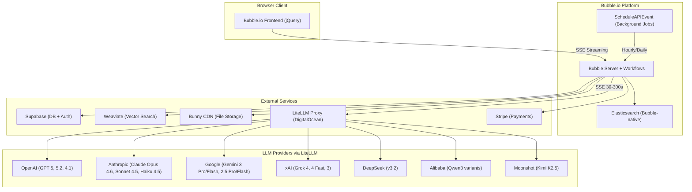
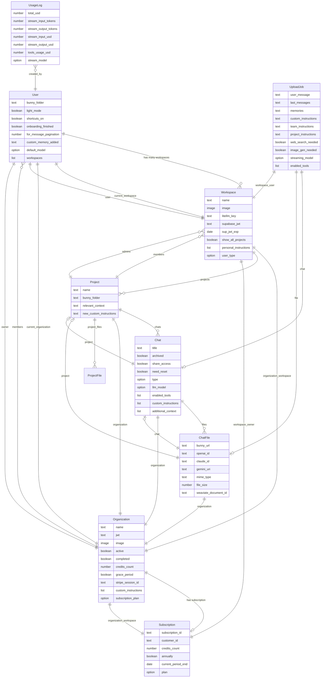
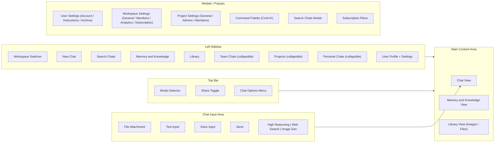
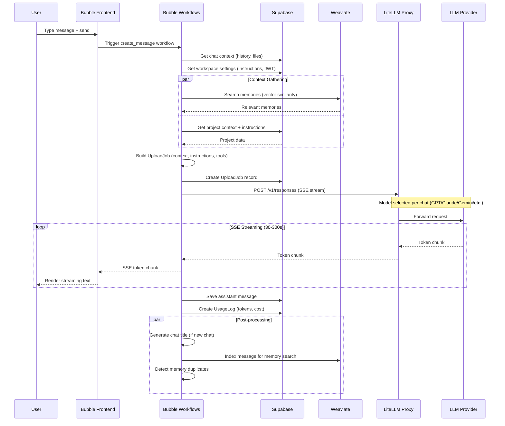
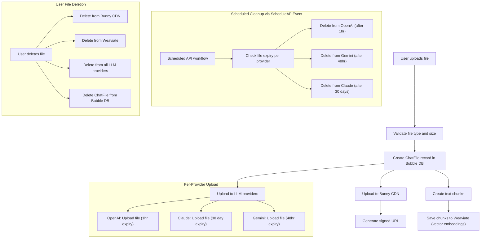
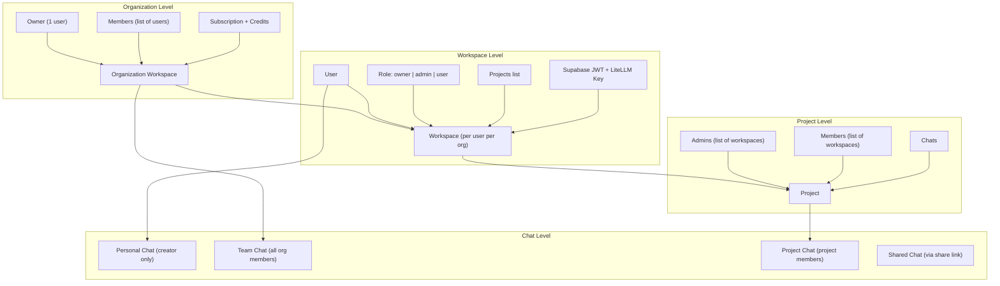
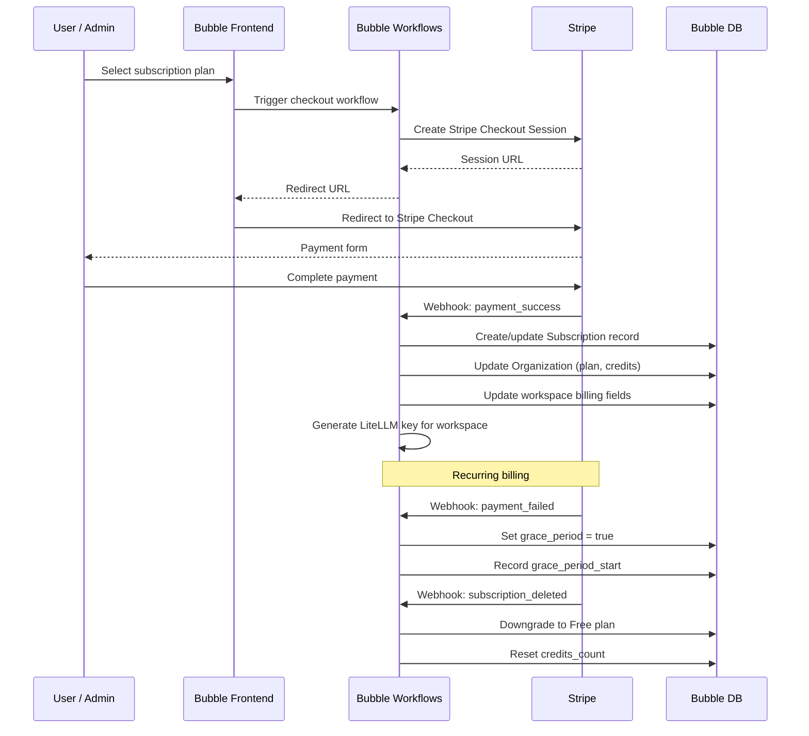

# Playgram Architecture Diagrams

*Created: March 6, 2026*

Visual documentation of the current Playgram platform (app.playgram.ai) as built on Bubble.io.

---

## 1. System Architecture Overview

How the current Bubble.io app connects to all external services.

---

## 2. Data Model (Entity Relationship)

Core entities and their relationships as they exist in the Bubble.io database. Active (non-deleted) fields only.

---

## 3. UI Layout and Navigation Structure

Information architecture and screen layout based on the live app and Bubble element definitions.

---

## 4. Chat Message Flow (Send Message to Streaming Response)

The core user flow when sending a message — from input through context gathering, LLM streaming, to post-processing.

---

## 5. File Processing Pipeline

How files flow through the system — from upload through chunking to vector indexing and LLM provider upload.

---

## 6. Multi-Tenancy and Access Control

How workspaces, organizations, users, and roles relate. Derived from the privacy_role definitions in the Bubble data model.

---

## 7. Billing and Subscription Flow

Stripe integration for subscription management, payment handling, and plan changes.

---

## Source References

- Data model: [bubble/playgram_split/user_types/](../../bubble/playgram_split/user_types/) (chat.js, workspace.js, index.js)
- LLM models: [bubble/playgram_split/option_sets/llm_models_os.js](../../bubble/playgram_split/option_sets/llm_models_os.js)
- API workflows: [bubble/playgram_split/api/](../../bubble/playgram_split/api/) (~90 files)
- UI components: [bubble/playgram_split/element_definitions/](../../bubble/playgram_split/element_definitions/)
- App analysis: [bubble_app_analysis.md](bubble_app_analysis.md)
- Live app screenshots: [screenshots/](screenshots/)
