# Playgram Platform Analysis

*Analysis conducted: March 2, 2026; Managerial functions added March 6, 2026*  
*Platform: app.playgram.ai*

---

## Executive Summary

Playgram is a sophisticated multi-model AI chat platform built entirely on Bubble.io, featuring robust organizational capabilities (projects, teams, memory), and a power-user focused interface. The platform aggregates multiple leading AI models into a single interface with built-in knowledge management and collaboration features.

---

## 1. Feature Discovery

### Core Features

#### A. Chat Management System
- **Personal Chats**: Individual AI conversations with full history
- **Team Chats**: Collaborative AI chat spaces for team-wide discussions
- **Projects**: Organize chats into project folders for better organization
- **Search Chats**: Full-text search across all conversations
- **Archive**: Archive old chats for later reference

*Main chat interface:*

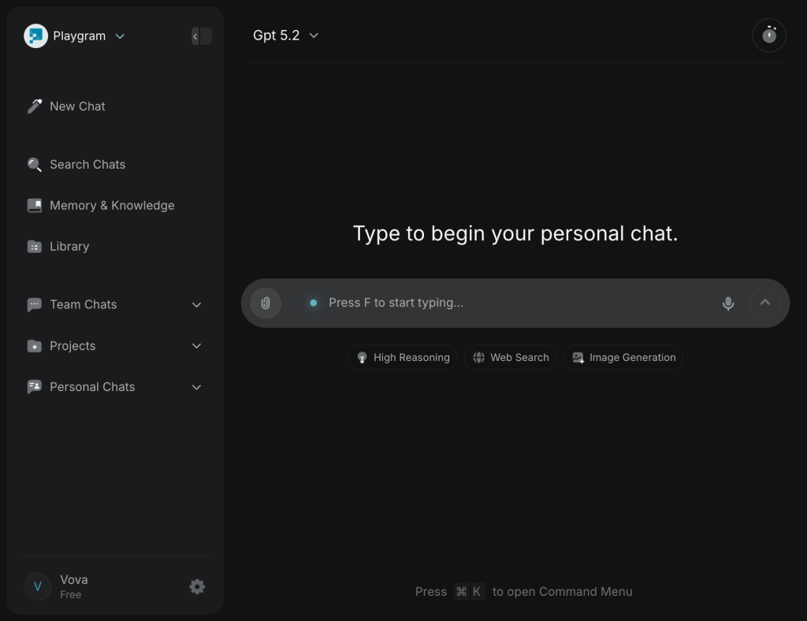

*Search interface:*

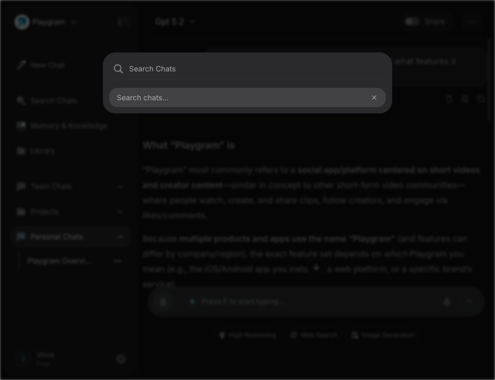

#### B. AI Model Support

The platform supports multiple AI model providers:

**OpenAI**
- GPT-5.2 and variants
- Description: "Balanced for most everyday tasks"

**Anthropic Claude**
- Claude Opus 4.6
- Claude Sonnet 4.6
- Claude Haiku 4.5
- Description: "Excellent at content and coding"

**Google Gemini**
- Description: "Perfect for complex tasks. Large context"

**xAI Grok**
- Description: "Best for real-time information"

**DeepSeek**
- Description: "Fast model for iterative brainstorming"

**Qwen**
- Description: "Reliable choice for coding assistance"

**Kimi**
- Description: "Enhanced agentic coding intelligence"

*Model selector interface:*

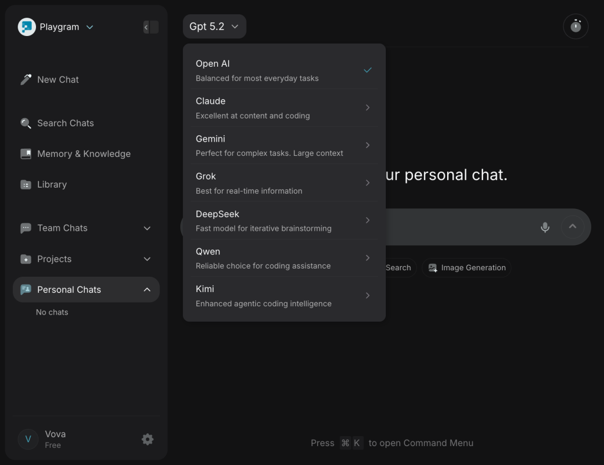

*Expanded Claude model options:*

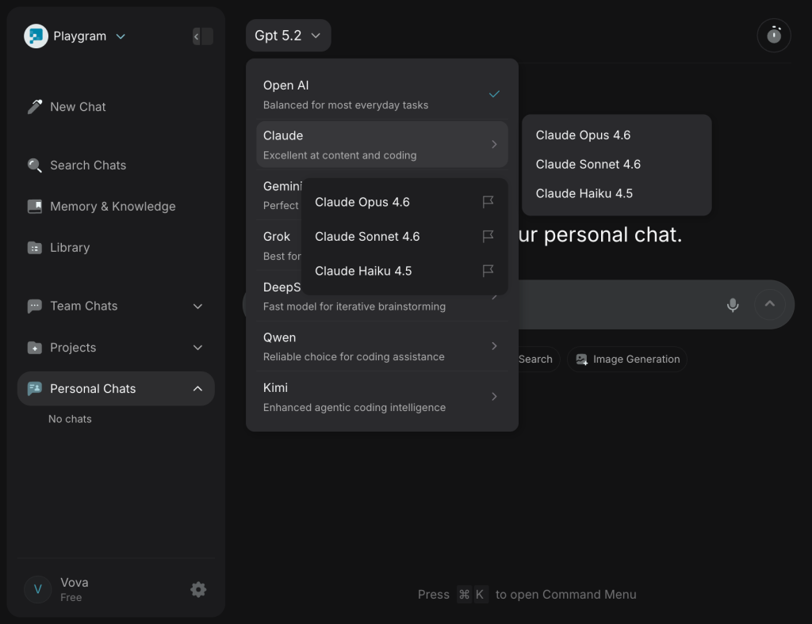

#### C. Advanced AI Features

Toggle-based feature enhancements:
- **High Reasoning Mode**: Enhanced analytical capabilities
- **Web Search Integration**: Real-time information retrieval
- **Image Generation**: Built-in image creation capabilities

#### D. Memory & Knowledge Base

Sophisticated knowledge management system:
- Manual upload of documents and text files
- Auto-saved conversation snippets
- Categorization options: Team, Project, Personal
- Search functionality within memory
- Drag-and-drop file upload support

*Memory & Knowledge interface:*

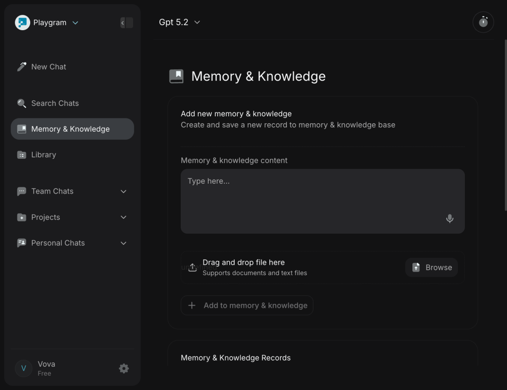

#### E. Library

Content storage and organization:
- **Images Tab**: Store and manage AI-generated images
- **Files Tab**: Store and manage generated files

*Images tab:*

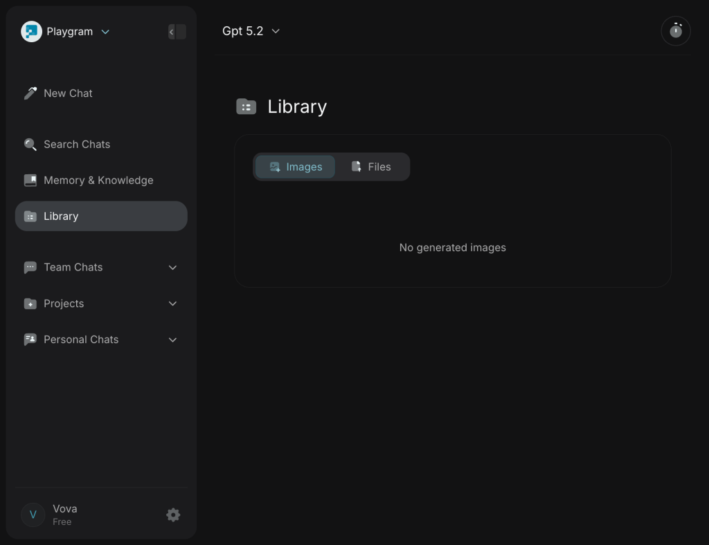

*Files tab:*

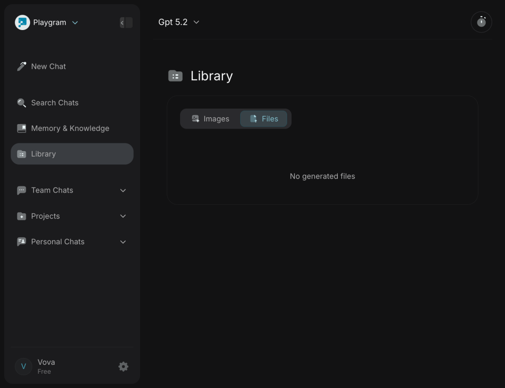

#### F. Workspace Management

Multi-workspace capabilities:
- Multiple workspace support
- Workspace invitation system
- Easy workspace switching
- Team collaboration within workspaces

*Workspace selector:*

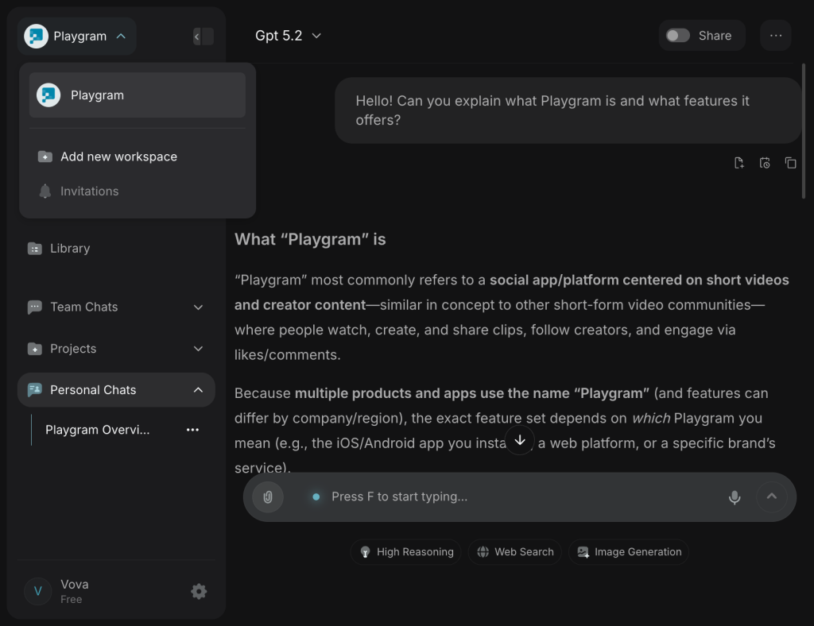

#### G. Workspace Settings (Managerial Functions)

Accessed via the gear icon next to the workspace name in the sidebar. URL: `?tab=workspace_settings` with subtabs via `&subtab=`.

**General Tab** (`subtab=general` or default)
- **Workspace icon/logo**: Editable avatar for the workspace
- **Admin project view**: Toggle controlling visibility — "See every project in the workspace. When off, you will only see projects that you are part of."
- **Name**: Editable workspace name
- **Instructions**: Team-wide custom instructions for LLM responses ("Add instructions to customize LLM responses for your team")

**Members Tab** (`subtab=members`)
- **Workspace members list**: All members with invitation status (accepted vs pending)
- **Search members**: Filter members by name/email
- **Invite members**: Add users by email; subscription plan selector for invited members
- **Remove member**: Delete member with confirmation popup ("Delete member?")
- **Delete invitation**: Cancel pending invitations with confirmation ("Delete invitation?")
- **Pagination**: For workspaces with many members

**Analytics Tab** (`subtab=analytics`)
- **Members analytics table**: Per-member usage metrics
- **Sortable columns**: Member email, total messages, total time (hours/minutes/seconds)
- **Search analytics**: Filter members in the analytics view
- **Admin analytics view**: Dropdown for admin-level analytics controls

**Subscription Tab** (`subtab=subscription`)
- **Subscription plans**: Free, Pro, and other tiers
- **Plan selection**: Choose plan when inviting members
- **Stripe integration**: Billing via Stripe (subscription payment success/failed/deleted webhooks)
- **Credits management**: Usage-based credits per plan

**Sidebar (Workspace-Level)**
- **Add new workspace**: Create additional workspaces
- **Invitations**: Pending workspace invitations (indicator when invitations exist); accept/decline from login-signup flow

**Project-Level Settings** (Popup per project)
- **General**: Project name and settings
- **Admins**: Project admin management
- **Members**: Project member management (distinct from workspace members)

#### I. User Settings & Customization

**Account Management**
- Profile information (name, email, password)
- Profile picture upload

**AI Customization**
- Custom instructions for AI response behavior
- Personalized AI interaction preferences

**Interface Preferences**
- Keyboard shortcuts toggle
- Various UI customization options

*Account settings:*

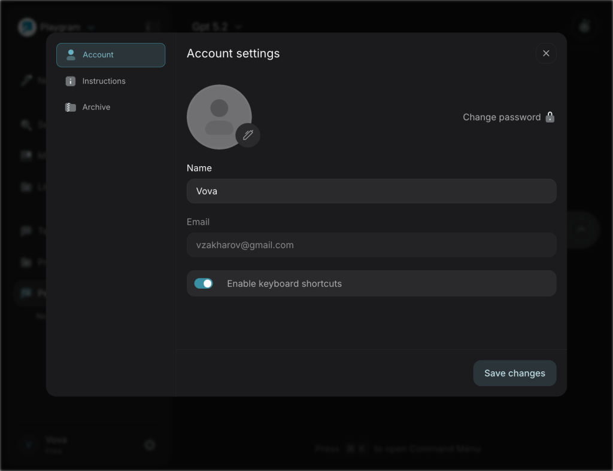

*Instructions settings:*

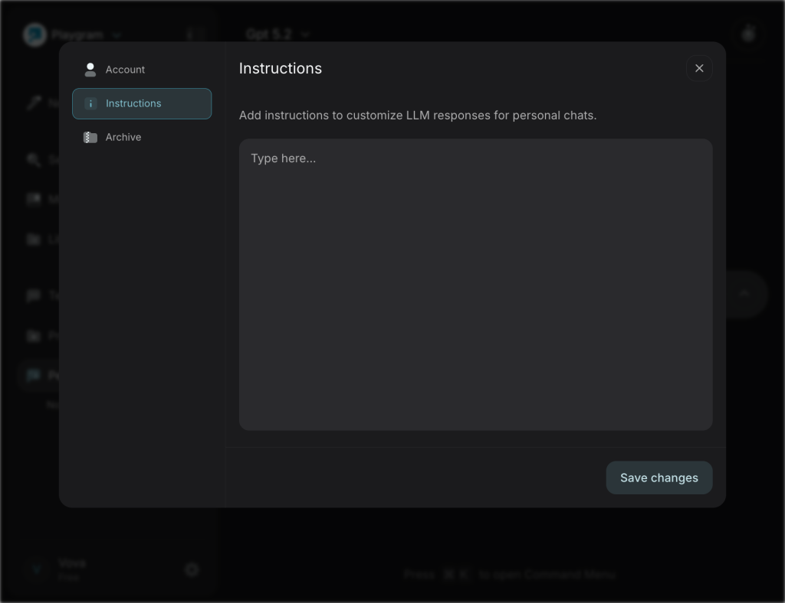

*Archive settings:*

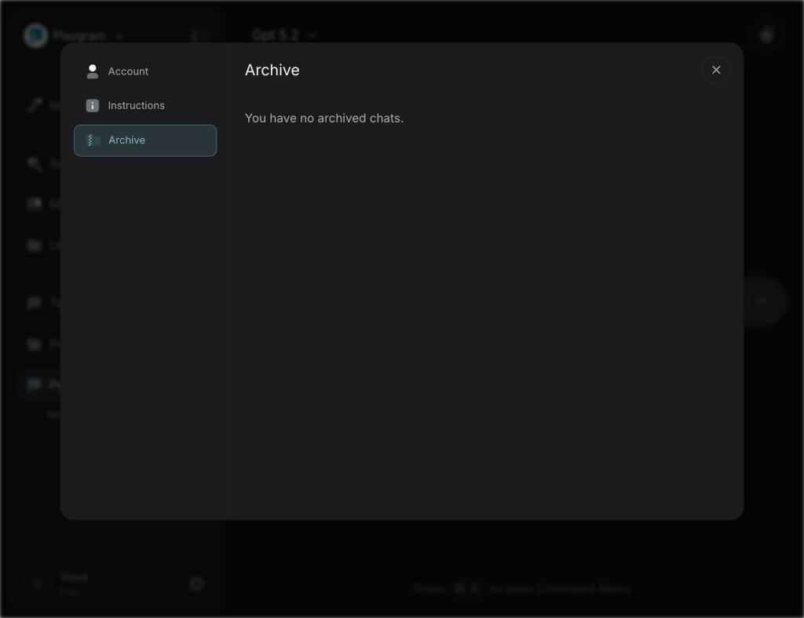

#### J. Command Palette (⌘K)

Extensive keyboard shortcut system for power users:

**Navigation**
- `F` - Focus Chat Input
- `/` - Search Chats
- `S` - Toggle Sidebar
- `L` - Open Library
- `G` - Open Memory

**Chat Actions**
- `N` - New Personal Chat
- `P` - New Project Chat
- `T` - New Team Chat
- `M` - Switch Model
- `A` - Add to Project
- `H` - Share Chat
- `E` - Archive Chat
- `Backspace` - Delete Chat

**Feature Toggles**
- `W` - Toggle Web Search
- `I` - Toggle Image Generation
- `R` - Toggle High Reasoning

**Message Navigation**
- `J` - Next Message
- `K` - Previous Message

**Other**
- `U` - Upload Files

*Command palette:*

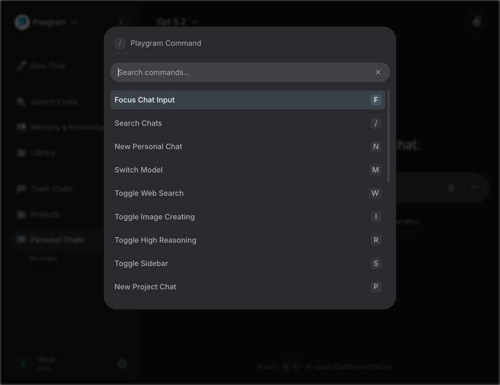

---

## 2. Technical Architecture

### Platform Foundation

**Core Technology**
- Built entirely on **Bubble.io** (no-code platform)
- Console message confirms: "This web application is entirely built without code on Bubble"
- All JavaScript and CSS served from Bubble CDN domains

### Backend Services & APIs

**Primary Backend**
- **Bubble API**: Core application endpoints
  - `/api/1.1/init/data` - Initial data loading
  - `/user/hi` - User session
  - `/user/m` - User messaging
  - `/user/apm` - Application performance monitoring
  - `/workflow/start` - Workflow engine

**Search & Data Management**
- **Elasticsearch**: Comprehensive search and data aggregation
  - `/elasticsearch/mget` - Multi-get operations
  - `/elasticsearch/msearch` - Multi-search queries
  - `/elasticsearch/maggregate` - Aggregation queries
  - `/elasticsearch/bulk_watch` - Bulk watch operations

**External Services**
- **Supabase**: Database and backend services (`yfwacubqdcixciehbjuj.supabase.co`)
- **DigitalOcean-hosted LLM API**: `zq-lite-llm-k6qjf.ondigitalocean.app/v1/responses`
- **CORS Proxy**: `cors-anywhere-zq.herokuapp.com`
- **Custom API Service**: `/apiservice/doapicallfromserver` (likely proxy for AI model calls)

### Frontend Stack

**Core Framework**
- **jQuery 3.6.4** - Primary JavaScript framework (no React/Vue/Angular)
- Traditional server-rendered approach via Bubble.io

**Rich Text & Code Editing**
- **Quill.js 1.3.7** - Rich text editor
- **CodeMirror 5.65.7** - Code editor with multiple language modes
- **Highlight.js 11.9.0** - Syntax highlighting
- **Marked.js** - Markdown parsing
- **KaTeX 0.16.10** - LaTeX math rendering

**UI & Interaction Libraries**
- **Anime.js 3.2.2** - Animations
- **jQuery UI 1.14.1** - UI components
- **jQuery qTip 3.0.3** - Tooltips
- **Air Datepicker 3.5.3** - Date selection
- **Clipboard.js** - Copy functionality

**Utilities**
- **Day.js 1.11.10** - Date/time handling
- **Fuse.js** - Fuzzy search
- **UAParser.js** - User agent parsing
- **heic2any** - Image format conversion
- **PDF Make** - PDF generation

**Payments**
- **Stripe.js** - Payment processing integration

**Analytics**
- **Microsoft Clarity** - User behavior analytics

### CSS & Styling

**Approach**
- Custom/Bubble-generated CSS (no Bootstrap, Tailwind, or Material-UI)
- Dark theme with excellent contrast (#2C2C2C base backgrounds)
- **Google Fonts**: Inter font family (primary typeface)
- Quill.js CSS themes (Snow & Bubble)

### Infrastructure

**CDN & Hosting**
- Bubble CDN for application assets
- CloudFlare CDN
- jsDelivr for library assets

**Third-Party Services**
- Stripe for payments
- Supabase for backend database/auth
- Elasticsearch for search functionality
- DigitalOcean for LLM API hosting
- Microsoft Clarity for analytics

---

## 3. User Experience Design

### Design System

**Visual Design**
- Modern dark theme as default
- High contrast for accessibility
- Consistent spacing and typography
- Clean, minimalist interface
- Professional color palette

**Navigation Patterns**
- Collapsible left sidebar for main navigation
- Top bar for contextual actions (model selection, chat options)
- Modal-based settings (non-intrusive)
- Bottom-left user menu

**Interaction Patterns**
- Inline AI model switching
- Toggle buttons for feature activation
- Drag-and-drop file uploads
- Real-time streaming AI responses with typing effect
- Command palette for keyboard-driven workflows

### Information Architecture

```
Workspace (Top Level)
├── Chat Management
│   ├── Personal Chats (individual conversations)
│   ├── Team Chats (collaborative spaces)
│   └── Projects (organized collections)
├── Knowledge Management
│   ├── Memory & Knowledge (uploaded context)
│   └── Library (generated content)
│       ├── Images
│       └── Files
├── Workspace Settings (Managerial)
│   ├── General (admin project view, name, LLM instructions)
│   ├── Members (invite, remove, search, pagination)
│   ├── Analytics (per-member usage: messages, time)
│   └── Subscription (plans, billing, credits)
├── Workspace-Level Actions
│   ├── Add new workspace
│   └── Invitations (pending workspace invites)
├── Project Settings (per project)
│   ├── General
│   ├── Admins
│   └── Members
├── Chat Actions
│   ├── New Chat (Personal/Project/Team)
│   ├── Search
│   ├── Share
│   ├── Archive
│   └── Delete
└── User Settings
    ├── Account
    ├── Instructions (AI customization)
    └── Archive
```

---

## 4. Performance Characteristics

### Loading Performance
- Initial page load: ~0.915 seconds (from console metrics)
- Multiple parallel API calls on page load (13+ Elasticsearch queries)
- Heavy JavaScript footprint: 76+ script files loaded

### API Architecture
- Real-time streaming for AI responses
- Elasticsearch used extensively for data retrieval and search
- Bulk operations for efficiency
- Session tracking and management via Supabase

### Security & Tracking
- Fingerprinting implementation for security/tracking
- Session management and authentication

---

## 5. Competitive Positioning

### Market Position
Playgram positions itself as a unified AI workspace that combines:
- Multi-model AI access (competitor to ChatGPT Plus, Claude Pro, Gemini Advanced)
- Knowledge management (similar to Notion AI, Personal.ai)
- Team collaboration (similar to Slack AI, Microsoft Copilot for Teams)

### Key Differentiators

**Unique Strengths**
- Multiple leading AI models in a single interface
- Built-in knowledge base with file support and organization
- Project and team-based organization of conversations
- Advanced feature toggles (reasoning, web search, image generation)
- Power-user optimizations (keyboard shortcuts, command palette)
- Unified library for generated content
- **Managerial controls**: Workspace settings (members, analytics, subscription), admin project view, per-member usage analytics, invitation management

**Technical Approach**
- No-code platform (Bubble.io) enabling rapid iteration
- Elasticsearch for robust search capabilities
- Supabase for modern backend infrastructure
- Custom LLM API aggregation layer

---

## Technical Insights for Engineering Candidates

### Architecture Observations

**Strengths of Current Stack**
1. **Rapid Development**: Bubble.io enables fast feature iteration without traditional development overhead
2. **Modern Backend**: Supabase provides real-time capabilities and robust data management
3. **Powerful Search**: Elasticsearch integration for comprehensive search functionality
4. **Multi-Model Integration**: Successfully aggregated multiple AI provider APIs

**Scale Considerations**
1. **Bubble.io Limitations**: May encounter scaling challenges as user base grows
2. **JavaScript Load**: 76+ scripts could impact performance on slower connections
3. **API Call Volume**: Multiple Elasticsearch calls on page load could be optimized

**Potential Evolution Path**
- Current stack works well for MVP and early growth
- Likely roadmap consideration: migration to custom stack (React/Next.js) for scale
- Opportunity for performance optimization in API call patterns

---

## Appendix: API Endpoints Observed

### Bubble Core APIs
- `POST /api/1.1/init/data`
- `POST /user/hi`
- `POST /user/m`
- `POST /user/apm`
- `POST /workflow/start`
- `POST /apiservice/doapicallfromserver`

### Elasticsearch APIs
- `POST /elasticsearch/mget`
- `POST /elasticsearch/msearch`
- `POST /elasticsearch/maggregate`
- `POST /elasticsearch/bulk_watch`

### External Services
- `https://yfwacubqdcixciehbjuj.supabase.co/*` (Supabase backend)
- `https://zq-lite-llm-k6qjf.ondigitalocean.app/v1/responses` (LLM API)
- `https://cors-anywhere-zq.herokuapp.com/*` (CORS proxy)

---

*This analysis is based on exploration sessions (March 2 and March 6, 2026). Managerial functions were discovered via browser session and Bubble codebase inspection.*
